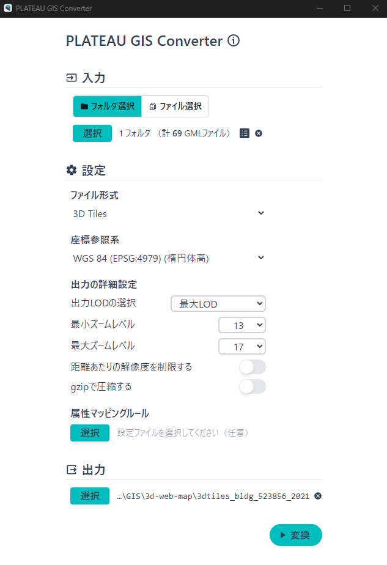

# 変換ツールと変換手順等を示したドキュメント
## 変換ツールの実行環境
 - OS : Windows 11 Pro(24H2)
 - CPU : AMD Ryzen 7 5700X 8-Core Processor 3.40 GHz
 - メモリ : 64.0GB
 - SSD : 4TB

## 使用データ
### VIRTUAL SHIZUOKA 点群データ（LPデータ オリジナルデータ（LAS形式））
 - G空間情報センターからVIRTUAL SHIZUOKA 点群データ(LPデータ オリジナルデータ(LAS形式))を取得します  
[VIRTUAL SHIZUOKA 点群データ](https://www.geospatial.jp/ckan/dataset?q=+VIRTUAL+SHIZUOKA+%E7%82%B9%E7%BE%A4&sort=metadata_modified+desc)

### 3D都市モデル（Project PLATEAU）沼津市（2021年度）CityGML（v2）
- G空間情報センターから3D都市モデル（Project PLATEAU）建築物モデル(CityGML形式)を取得します  
[3D都市モデル（Project PLATEAU）沼津市（2021年度）](https://www.geospatial.jp/ckan/dataset/plateau-22203-numazu-shi-2021)
- なお、沼津市は2023年度のデータも公開されているが、変換コンバータでの変換処理が上手くいかないため2021年度のデータを使用した。

## 対象範囲
- 静岡県沼津市
  - 2次メッシュ(10km四方) : 523856
  - 3次メッシュ(1km四方) : 52385628


## 3次元点群データの3D Tilesへの変換
### 変換ツール
- QGIS 3.34.12（付属のPDAL）
  - pdal 2.8.1
  - https://pdal.io/en/2.8.1/

- py3dtiles 9.0.0
  - https://py3dtiles.org/v9.0.0/

### 変換ツールのインストール
- pdal
  - QGIS 3.34.12をインストールするとOSGeo4W ShellとPDALがインストールされます
  - OSGeo4W Shellを起動して、pdalコマンドを実行します
  - pdalのバージョンを確認します
    ```
    C:\Program Files\QGIS 3.34.12>pdal --version
    --------------------------------------------------------------------------------
    pdal 2.8.1 (git-version: a06325)
    --------------------------------------------------------------------------------
    ```
- py3dtiles
  - コマンドプロンプトを起動して以下のコマンドを実行してインストールします
    ```
    pip install py3dtiles
    ```
    - py3dtilesのバージョンを確認します
      ```
      C:\Users\yshiw>pip show py3dtiles
      Name: py3dtiles
      Version: 9.0.0
      Summary: Python module for 3D tiles format
      Home-page: https://py3dtiles.org
      Author:
      Author-email: The Py3DTiles team <contact@oslandia.com>
      License: Apache-2.0
      Location: C:\Users\yshiw\AppData\Local\Programs\Python\Python312\Lib\site-packages
      Requires: cython, earcut, lz4, numba, numpy, psutil, pygltflib, pyproj, pyzmq
      Required-by:
      ```
  - LAZを処理できるようにlaspy[laszip]をインストールします
    ```
    pip install laspy[laszip]
    ```

### LASのマージ
- 3次元点群データは[国土基本図図郭の地図情報レベル500(縦300ｍ横400ｍサイズ)](https://club.informatix.co.jp/?p=1293)になっているため、LASを2次メッシュ（10km四方）単位および3次メッシュ（1km四方）単位でマージします
- マージには、pdalのpiplineを使用します
- pipeline-merge-2ji.json、pipeline-merge-3ji.jsonを用意します
- "bounds"には対象となる2次メッシュおよび3次メッシュの左下のY座標、右上のY座標、左下のX座標、右上のX座標を指定します※3次元点群データが平面直角座標系8系のためX座標やY座標は平面直角座標系8系で指定します
- 下記は2次メッシュコード:523856および3次メッシュコード:52385628のマージの例です
- pipeline-merge-2ji.json
  ```json title="pipeline-merge-2ji.json"
  {
    "pipeline": [
      {
        "type": "readers.las",
        "filename": "LAS/*.las"
        },
        {
          "type": "filters.crop",
          "bounds": "([22796.6255,34160.1723],[-101665.9012,-92385.7861])"
        },
        {
          "type": "writers.las",
          "filename": "523856.las"
        }
    ]
   }
  ```
- pipeline-merge-3ji.json
  ```json title="pipeline-merge-3ji.json"
  {
    "pipeline": [
      {
        "type": "readers.las",
        "filename": "LAS/*.las"
        },
        {
          "type": "filters.crop",
          "bounds": "([31908.8161,33045.0584],[-99789.5937,-98861.0851])"
        },
        {
          "type": "writers.las",
          "filename": "52385628.las"
        }
    ]
  }
  ```
- pdalのpipelineを実行してマージを行います
  ```
  pdal pipeline pipeline-merge-2ji.json
  ```
  ```
  pdal pipeline pipeline-merge-3ji.json
  ```

### LAZへ変換
- LASはファイルサイズが大きいため、一旦LAZに変換します
- pdalのtranslateでLASからLAZへ変換します
  ```
  pdal translate 523856.las 523856.laz
  ```
  ```
  pdal translate 52385628.las 52385628.laz
  ```

### 座標参照系の付与
- 元の3次元点群データには座標参照系が付与されていないため、pdal translateで座標参照系を付与します
- 元の3次元点群データは平面直角座標系第8系ですので"EPSG:6676"を指定します
  ```
  pdal translate -i 523856.laz -o 523856_6676.laz --writers.las.a_srs="EPSG:6676"
  ```
  ```
  pdal translate -i 52385628.laz -o 52385628_6676.laz --writers.las.a_srs="EPSG:6676"
  ```

### メタ情報の確認
- pdal infoで座標参照系が付与されているか確認します
  ```
  pdal info --metadata 523856_6676.laz
  ```
  ```
  pdal info --metadata 52385628_6676.laz
  ```

### X座標とY座標の入れ替え
- 元の3次元点群データの"X"と"Y"を平面直角座標系に合わせるために、X座標とY座標を入れ替えます
- X座標とY座標の入れ替えには、pdalのpipelineを使用します
- xy_switch_pipeline_2ji.json、xy_switch_pipeline_3ji.jsonを用意します
-  xy_switch_pipeline_2ji.json
   ```json title="xy_switch_pipeline_2ji.json"
   [
    {
      "type": "readers.las",
      "filename": "523856_6676.laz",
      "spatialreference": "EPSG:6676"
    },
    {
      "type": "filters.reprojection",
      "in_srs": "EPSG:6676",
      "out_srs": "EPSG:6676",
      "in_axis_ordering": "2, 1"
    },
    {
      "type": "writers.las",
      "filename": "523856_6676_swaped.laz",
      "forward": "header,scale,vlr",
      "offset_x": "auto",
      "offset_y": "auto",
      "offset_z": "auto"
    }
   ]
   ```
- xy_switch_pipeline_3ji.json
   ```json title="xy_switch_pipeline_3ji.json"
   [
    {
      "type": "readers.las",
      "filename": "52385628_6676.laz",
      "spatialreference": "EPSG:6676"
    },
    {
      "type": "filters.reprojection",
      "in_srs": "EPSG:6676",
      "out_srs": "EPSG:6676",
      "in_axis_ordering": "2, 1"
    },
    {
      "type": "writers.las",
      "filename": "52385628_6676_swaped.laz",
      "forward": "header,scale,vlr",
      "offset_x": "auto",
      "offset_y": "auto",
      "offset_z": "auto"
    }
   ]
  ```
- pdalのpipelineを実行してX座標とY座標を入れ替えます
  ```
  pdal pipeline xy_switch_pipeline_2ji.json
  ```
  ```
  pdal pipeline xy_switch_pipeline_3ji.json
  ```

### 3D Tilesの生成
- コマンドプロンプトを起動して、py3dtilesを実行して、3D Tilesを生成します
- 
```
py3dtiles convert --srs_in 6676 --srs_out 4978 --out 3dtiles_pc_523856 --jobs 10 523856_6676_swaped.laz
```
```
py3dtiles convert --srs_in 6676 --srs_out 4978 --out 3dtiles_pc_52385628 --jobs 10 52385628_6676_swaped.laz
```

## 3D都市モデルPLATEAU建築物モデルの3D TilesおよびMapbox Vector Tile(MVT)への変換
### 変換ツール
- Project-PLATEAU / PLATEAU-GIS-Converter  
- https://github.com/Project-PLATEAU/PLATEAU-GIS-Converter
  - PLATEAU-GIS-Converter v0.0.0-alpha.37
  - https://github.com/MIERUNE/PLATEAU-GIS-Converter/releases
    - PLATEAU.GIS.Converter_0.1.0_x64-setup.exe
### 変換ツールのインストール
- こちらの変換ツールのマニュアル「windowsでのインストール」をもとにインストールします  
https://project-plateau.github.io/PLATEAU-GIS-Converter/manual/install.html

### 3D Tilesへの変換
- PLATEAU-GIS-Converterを起動して、以下のように設定して3D Tilesに変換します
  - CityGMLが格納されているフォルダを指定します
    - あらかじめ対象範囲の2次メッシュおよび3次メッシュのCityGMLのみを格納します
  - ファイル形式に3D Tiles、座標参照系にWGS 84(EPSG:4949)(楕円体高)を指定します
  - 出力LODは最大LODを指定します
  - 最小ズームレベルに13、最大ズームレベルに17を指定します
  - 最後に、出力先フォルダを指定して、変換を実行します



### MVTへの変換
- PLATEAU-GIS-Converterを起動して、以下のように設定してMVTに変換します
  - CityGMLが格納されているフォルダを指定します
    - あらかじめ対象範囲の2次メッシュおよび3次メッシュのCityGMLのみを格納します
  - ファイル形式にVector Tiles(MVT)を指定します
  - 出力LODは最大LODを指定します
  - 最小ズームレベルに13、最大ズームレベルに17を指定します
  - 最後に、出力先フォルダを指定して、変換を実行します


# 変換後のウェブ地図用3次元データ（3D Tiles形式）
## ウェブ地図用3次元データダウンロードURL
※3次元データは最大で35GB程度のため、ダウンロードする際は通信環境にご注意ください  
※3次元点群データの3D Tilesのバージョンは1.0、3D都市モデルPLATEAU建築物モデルの3D Tilesのバージョンは1.1となっています。  
※3D都市モデルPLATEAU建築物モデルの3D Tilesのバージョンは1.1ですが、deck.glでの読み込みに対応させるため、tileset.jsonの"version": "1.0"を"version": "0.0"に変更しています。  
- 3次元点群データ2次メッシュ523856(3D Tiles形式)  
https://public-data.geolonia.com/komazawa-u-3dmap/3dtiles_pc_523856.zip
- 3次元点群データ3次メッシュ52385628(3D Tiles形式)  
https://public-data.geolonia.com/komazawa-u-3dmap/3dtiles_pc_52385628.zip
- 3D都市モデルPLATEAU建築物モデル2次メッシュ523856(3D Tiles形式)  
https://public-data.geolonia.com/komazawa-u-3dmap/3dtiles_bldg_523856_2021.zip
- 3D都市モデルPLATEAU建築物モデル3次メッシュ52385628(3D Tiles形式)  
https://public-data.geolonia.com/komazawa-u-3dmap/3dtiles_bldg_52385628_2021.zip
- 3D都市モデルPLATEAU建築物モデル2次メッシュ523856(MVT形式)  
https://public-data.geolonia.com/komazawa-u-3dmap/mvt_bldg_523856_2021.zip
- 3D都市モデルPLATEAU建築物モデル3次メッシュ52385628(MVT形式)  
https://public-data.geolonia.com/komazawa-u-3dmap/mvt_bldg_52385628_2021.zip  

### 3Dウェブ地図表示ツール用URL
- 3次元点群データ2次メッシュ523856(3D Tiles形式)  
`https://public-data.geolonia.com/komazawa-u-3dmap/3dtiles_pc_523856/tileset.json`
- 3次元点群データ3次メッシュ52385628(3D Tiles形式)  
`https://public-data.geolonia.com/komazawa-u-3dmap/3dtiles_pc_52385628/tileset.json`  
- 3D都市モデルPLATEAU建築物モデル2次メッシュ523856(3D Tiles形式)  
`https://public-data.geolonia.com/komazawa-u-3dmap/3dtiles_bldg_523856_2021/tileset.json`  
- 3D都市モデルPLATEAU建築物モデル3次メッシュ52385628(3D Tiles形式)  
`https://public-data.geolonia.com/komazawa-u-3dmap/3dtiles_bldg_52385628_2021/tileset.json`  
- 3D都市モデルPLATEAU建築物モデル2次メッシュ523856(MVT形式)  
`https://public-data.geolonia.com/komazawa-u-3dmap/mvt_bldg_523856_2021/{z}/{x}/{y}.pbf`  
- 3D都市モデルPLATEAU建築物モデル3次メッシュ52385628(MVT形式)  
`https://public-data.geolonia.com/komazawa-u-3dmap/mvt_bldg_52385628_2021/{z}/{x}/{y}.pbf`  


### 3Dウェブ地図表示ツール（3Dウェブ地図表示ツールの開発補助業務（駒澤大学））
- CesuimJS
  - 静岡県沼津市 3次元点群データ（3D Tiles）  
https://geolonia.github.io/komazawa-u-3dmap/index_1_1.html
  - 静岡県沼津市 建築物モデル（3D Tiles）  
https://geolonia.github.io/komazawa-u-3dmap/index_1_2.html

- MapLibre GL JS
  - 静岡県沼津市 3次元点群データ（3D Tiles）  
https://geolonia.github.io/komazawa-u-3dmap/index_2_1.html
  - 静岡県沼津市 建築物モデル（3D Tiles）  
https://geolonia.github.io/komazawa-u-3dmap/index_2_2.html
  - 静岡県沼津市 建築物モデル（MVT）  
https://geolonia.github.io/komazawa-u-3dmap/index_2_3.html
